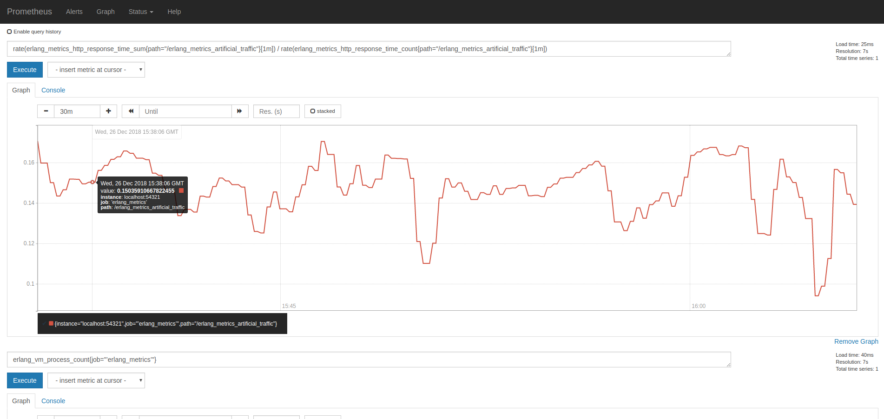

  # ErlangMetrics
A simple demo application in Erlang, exposing a HTTP port 54321 for Prometheus to scrape metrics from.

###### Notes:
- Erlang installed ( not going to cover installing erlang )

###### TODO:
- Docker Service ( docker-compse ) still TODO, the below steps installs everything on 1 machine

# Getting Started

## 1. Erlang Web Server
Download the repository, compile, build a release and run the demo app.
```bash
$ git clone https://github.com/ruanpienaar/erlang_metrics
$ cd erlang_metrics && make
$ /_build/default/rel/erlang_metrics/bin/erlang_metrics console
```
Test erlang_metrics
```
$ curl localhost:54321/metrics
```

Should see some metrics

## 2. Prometheus

### 2.1. Prometheus Server

#### 2.1.1.1 (Mac Osx) Prometheus Server download and install

Download [link](https://prometheus.io/download/)
```bash
$ wget https://github.com/prometheus/prometheus/releases/download/v2.6.0/prometheus-2.6.0.darwin-amd64.tar.gz
$ tar -xvzf prometheus-2.6.0.darwin-amd64.tar.gz
```

#### 2.1.1.2 (Linux) Prometheus Server download and install

Download [link](https://prometheus.io/download/)
```bash
$ wget https://github.com/prometheus/prometheus/releases/download/v2.6.0/prometheus-2.6.0.linux-amd64.tar.gz
$ tar -xvzf prometheus-2.6.0.linux-amd64.tar.gz
```

#### 2.1.2. Prometheus server config

Setup 2 scrape jobs below, from localhost:9090 ( prometheus itself ) and localhost:54321 ( the demo metrics app )
Edit prometheus.yml inside the downloaded directory.
```
# Sample Config ( 2 jobs - prometheus + erlang_metrics )
global:
  scrape_interval:     15s # Set the scrape interval to every 15 seconds. Default is every 1 minute.
  evaluation_interval: 15s # Evaluate rules every 15 seconds. The default is every 1 minute.
  # scrape_timeout is set to the global default (10s).

# Alertmanager configuration
alerting:
  alertmanagers:
  - static_configs:
    - targets:
      # - alertmanager:9093

# Load rules once and periodically evaluate them according to the global 'evaluation_interval'.
rule_files:
  # - "first_rules.yml"
  # - "second_rules.yml"

# A scrape configuration containing exactly one endpoint to scrape:
# Here it's Prometheus itself.
scrape_configs:
  # The job name is added as a label `job=<job_name>` to any timeseries scraped from this config.
  - job_name: 'prometheus'

    # metrics_path defaults to '/metrics'
    # scheme defaults to 'http'.

    static_configs:
    - targets: ['localhost:9090']

  - job_name: ’erlang_metrics’
    static_configs:
      - targets: ['localhost:54321']
```

#### 2.1.3. Prometheus server start

```
$ ./prometheus --config.file=prometheus.yml
```

- Prometheus server will expose it's own metrics on Port 9090 and /metrics

Test the prometheus server metrics running ok:
```
$ curl localhost:9090/metrics
```

Check that both targets are ok:
```
$ http://localhost:9090/targets
```

Should see some metrics

### 2.2 Prometheus expression browser

Visit the expression-browser [here](http://localhost:9090/graph) in which you'll write metric queries.

More Info at this [link](https://prometheus.io/docs/prometheus/latest/querying/basics/)

#### 2.2.1 Prometheus Erlang app metric example

Simple example:

Add the following to the expression input:
```
erlang_vm_memory_system_bytes_total
```


Example of histogram for erlang_metrics_handler response times in Ms, erlang process count and memory in bytes

View the graph on this [link](http://localhost:9090/graph?g0.range_input=15m&g0.stacked=0&g0.expr=rate(erlang_metrics_http_response_time_sum%7Bpath%3D%22%2Ferlang_metrics_artificial_traffic%22%7D%5B1m%5D)%20%2F%20rate(erlang_metrics_http_response_time_count%7Bpath%3D%22%2Ferlang_metrics_artificial_traffic%22%7D%5B1m%5D)&g0.tab=0&g1.range_input=15m&g1.expr=erlang_vm_process_count%7Bjob%3D%22%E2%80%99erlang_metrics%E2%80%99%22%7D&g1.tab=0&g2.range_input=15m&g2.expr=erlang_vm_memory_bytes_total%7Bjob%3D%22%E2%80%99erlang_metrics%E2%80%99%22%2Ckind%3D%22processes%22%7D&g2.tab=0)



#### 2.2.2 [Prometheus metric types]((https://prometheus.io/docs/concepts/metric_types/)) & ( [Erlang Client](https://github.com/deadtrickster/prometheus.erl) )

  - Prometheus
    - [Counter]()
    - Gauge
    - Histogram
    - Summary

## 3. Grafana

## 4. Elastic

## 5. Kibana
